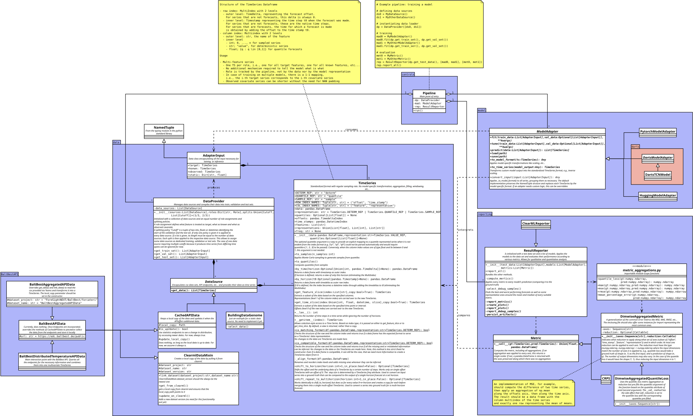

# forcateri
FOrecast TEst RIg - A middleware framework to evaluate and compare the performance of heterogeneous forecasts in ClearML

## Code structure

The an editable version of this diagram can be found [here](./doc/class_diagram.dia) in .dia format and opened using the [Dia editor](https://github.com/GNOME/dia)
